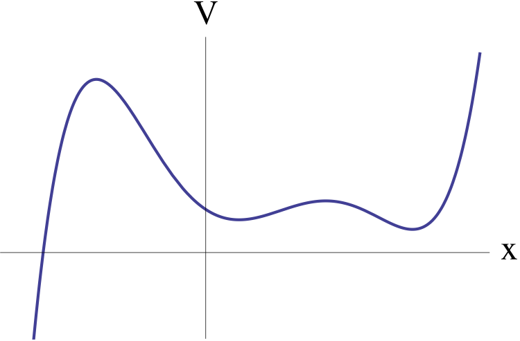
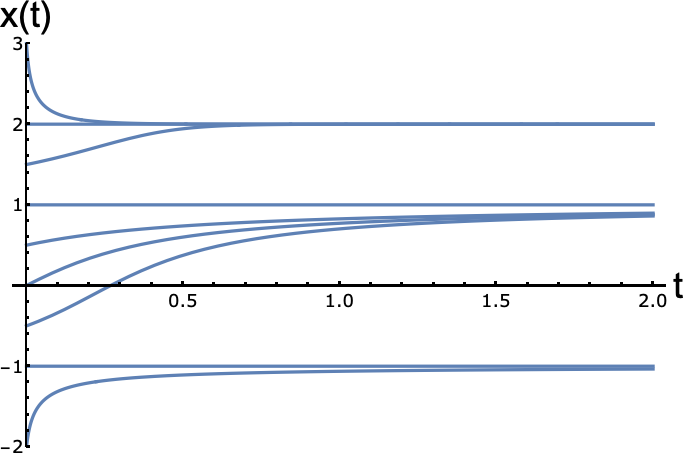

```{r, setup, include=FALSE}
require(mosaic)   # Load additional packages here 
knitr::opts_chunk$set(
  tidy=FALSE,     # display code as typed
  size="small")   # slightly smaller font for code
```


# A particle travels on the half-line $x > 0$ with a velocity given by $\dot x = -x ^c$.

a. Find all values of c such that the origin is a fixed point:

\ 

\ 

\ 

\ 


```{r echo=FALSE, message=FALSE, fig.dim=c(6,5.4), fig.align='center'}
library(phaseR)
example1a <- function (t, y, parameters) {list(y*0)}
example1a_phasePortrait <- phasePortrait(
  example1a,ylim=c(-5,5),points = 10,col = "darkgreen")
```

b. Now assume that c is chosen such that x = 0 is stable. Can the particle ever reach the origin in finite time? Specifically, how long does it take for the particle to travel from x = 1 to x = 0, as a function of c?


\newpage


# Sketching Phase portraits for Vector fields and Gradient Systems

--------------------

## Gradient Systems 

Consider the dynamical system $\dot x = - \frac{dV}{dx}$ with V(x) plotted below.

```{r echo=FALSE, out.width=200, fig.align='center'}

```

------------------------------

\newpage

## Consider the dynamical system $\dot x = ax-x^3$ where a is a real number that can be positve, negative, or zero.

a. For all 3 cases, find the fixed point, classify stability, and sketch the graph of x(t) for different initial conditions:

`Case 1:`

$\dot x = ax-x^3$

```{r echo=FALSE, message=FALSE,fig.dim=c(3,3), fig.align='default', fig.pos='asis'}
library(phaseR)
example2 <- function (t, y, parameters) {list(y -y^3)}
example2_phasePortrait <- phasePortrait(
  example2,ylim = c(-1.5, 1.5),points = 10,frac = 0.5, col = "navy")

example2a <- function (t, y, parameters) {list(0*y -y^3)}
example2a_phasePortrait <- phasePortrait(
  example2a,ylim = c(-1.5, 1.5),points = 10,frac = 0.5, col = "darkgreen")

example2b <- function (t, y, parameters) {list(-1.5*y -y^3)}
example2b_phasePortrait <- phasePortrait(
  example2b,ylim = c(-1.5, 1.5),points = 10,frac = 0.5, col = "purple")
```


`Case 1:`

$\dot x = ax-x^3$


`Case 1:`

$\dot x = ax-x^3$


\newpage 


b. For all 3 cases, calculate and plot the potential function V(x)


\newpage


# Relationship between solution curves, vector fields, and phase portraits


------------------------------------------

## For the following equations, sketch the vector fields on the real line; if possible, find all fixed points, classify their stability, and sketch the graph of x(t) for different initial conditions:


a. $\dot x = 4x^2 - 16$
b. $\dot x = x-x^3$
c. $\dot x = 1+2\sin{x}$
d. $\dot x = e^{-x}(\sin{x}-\cos{x})$


```{r echo=FALSE, message=FALSE,fig.dim=c(3,3), fig.align='default', fig.pos='asis'}
library(phaseR)
example3 <- function (t, y, parameters) {list(4*y^2 -16)}
example3_phasePortrait <- phasePortrait(
  example3,ylim = c(-3, 3),points = 10,col = "darkgreen")

library(phaseR)
example4 <- function (t, y, parameters) {list(y-y^3)}
example4_phasePortrait <- phasePortrait(
  example4,ylim = c(-3, 3),points = 10,col = "purple")

library(phaseR)
example5 <- function (t, y, parameters) {list(1+2*sin(y))}
example5_phasePortrait <- phasePortrait(
  example5,ylim = c(-10, 10),points = 10,col = "blue")

library(phaseR)
example6 <- function (t, y, parameters) {list(exp(-y)*(sin(y)-cos(y)))}
example6_phasePortrait <- phasePortrait(
  example6,ylim = c(-5.8,0.5),points = 10,col = "magenta")

```


\newpage

-------------------------------------

## In the figure below several solution curves x(t) to the system $\dot x = f(x)$ are illustrated. Which of the following phase portraits are consistent with these solution curves.

```{r echo=FALSE, out.width=200, fig.align='center'}

```


\newpage


## Consider the following system where $r, a \in R$:

$$\dot x = rx + ax^2 -x^3$$

a. For each a, there is a bifurcation diagram in the parameter r. As a varies, these bifurcations can undergo qualitative changes. Sketch all of the qualitatively different bifurcation diagrams that can be obtained by varying a.

b. Summarize your results by plotting a “phase diagram” in the parameters r and a. That is, plot the regions in the (r,a) plane that correspond to qualitatively different class of vector fields. Bifurcations occur on the boundaries of these regions; identify the types of bifurcations that occur.

\newpage


