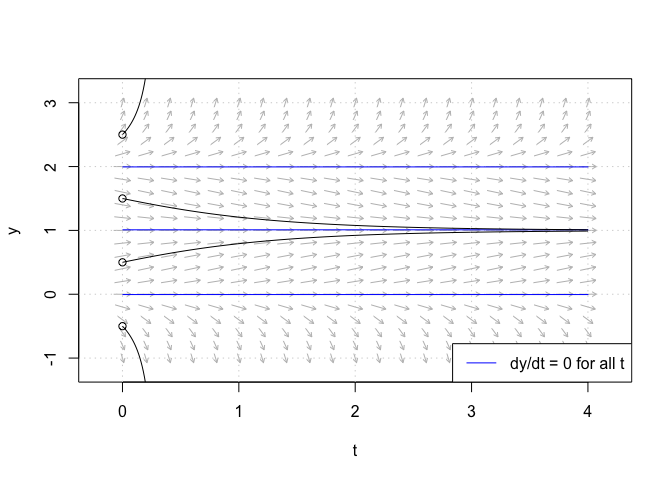
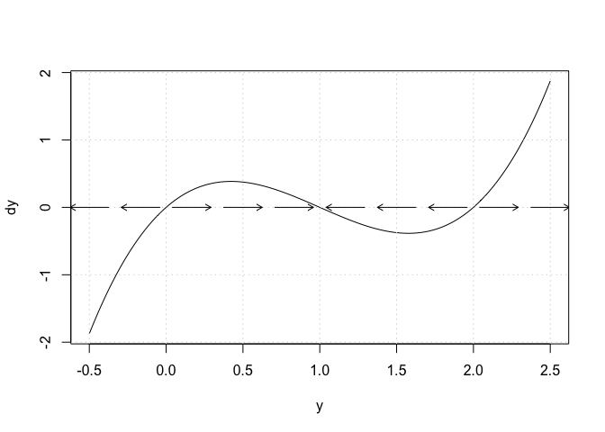
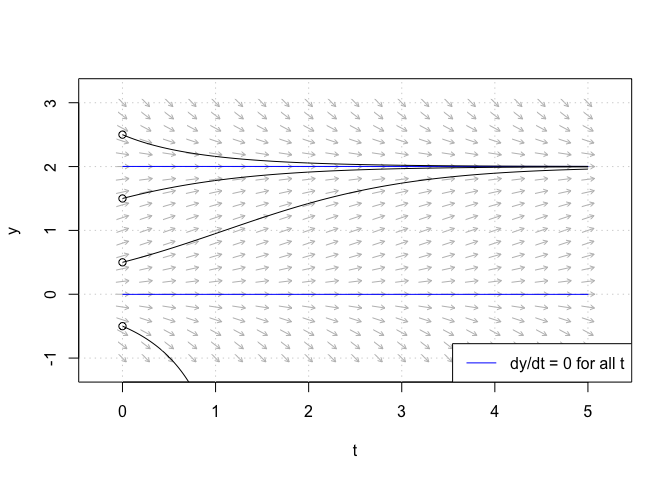
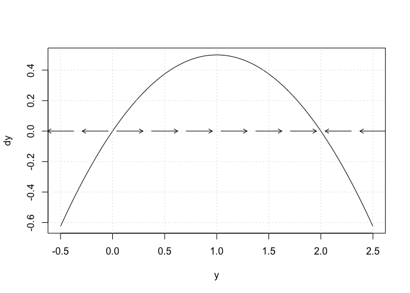

## Phase Plane Analysis in R

`phaseR`: An R package for phase plane analysis of one and
two-dimensional autonomous ODE systems (Grayling 2014).

-----

## Example 1. one-dimesnional ODE

<div class="a">


Consider the one-dimensional autonomous ODE:
\[\frac{dy}{dt}=y(1-y)(2-y)\]

</div>

### Flow Field

Consider the one-dimensional autonomous ODE:
\[\frac{dy}{dt}=y(1-y)(2-y)\]

\[\longrightarrow \hat y= \frac{dy}{dt}\]

The following plots the flow field and various trajectories, adding
**horizontal lines at equilibrium points**:



### Find Fixed Points

The horizontal lines on the graph indicate that **3 equilibrium points
have been identified at \(y^*=0,1,2\)**

If we set \(\hat y=0,\) we can analytically solve for the 3 equilibrium
points:

\[ y^* (1-y^* )(2-y^* )=0 \\
\Longrightarrow y^*=0,1,2 \]

### Determine Stability of Fixed Points

##### Method 1. `Phase Portrait`

<div class="b1">

Plotting the **phase portrait**, we find that \(y^*=0\) and \(y^*=2\)
are unstable; and \(y^*=1\) is stable

</div>

 

<!-- -->

-----

##### Method 2. `Taylor Series Approach`

<div class="b1">

Using the Taylor Series approach we have:


\[ \frac{d}{dy}\left.\left(\frac{dy}{dt}\right)\right|_{y=y^*} = 3y^{*^2} - 6y^* + 2 = \begin{cases} 2 &: \ y^*=0,\\ -1 &: \ y^*=1,\\ 2 &: \ y^*=2.  \end{cases} \]

</div>

 

We draw the same conclusion as from the phase portrait. We can confirm
the Taylor analysis using `stability()` to check the **stability of each
equilibrium point**:

    ## discriminant = 2, classification = Unstable

    ## discriminant = -1, classification = Stable

    ## discriminant = 2, classification = Unstable

-----

##### Perturbation Analysis

  - assuming higher order terms can be neglected

Note \(f(y^*)=0\), the autonomous ODE becomes:

\[ \frac{d}{dt}(y^*+\delta)=\delta\frac{\partial f}{\partial y}(y^*) \Rightarrow \frac{d\delta}{dt}=\delta\frac{\partial f}{\partial y}(y^*)=k\delta. \]

The above ODE for \(\delta\) can be solved to give
\(\delta(t)=\delta(0)e^{kt}\). So, stability can be found depending on
whether \(\delta(t)\) grows or decays as \(t\) increases:

\[ k = \frac{\partial f}{\partial y}(y^*)\begin{cases} > 0 &: \ \text{Stable},\\ < 0 &: \ \text{Unstable}.  \end{cases} \]

Here, \(k\) can be called the discriminant

-----

Returning to the given example…

\[ \frac{\partial f}{\partial y}(y^*) = -2y^*= \begin{cases} -4 &: \ y^*=2, \\ +4 &: \ y^* = -2. \end{cases}\]

Hence we reach conclusion as above;

  - \(y^*=2\) is stable, and \(y^*=-2\) is unstable

The above shows that we can state if \(y(0)>2\) or \(0<y(0)<2\) then the
solution will eventually approach \(y=2\).

However, if \(y(0)<0\), \(y\rightarrow-\infty\) as
\(t\rightarrow\infty\).

-----

##### Taylor Series Conditions

If \(\mathcal{k}=0\),

\[\Rightarrow\frac{\partial f}{\partial y}(y^*)=0, \]

then to the order of the Taylor Series **no conclusion can be drawn
about stability**.

-----

### Summary

The above demonstrates the components necessary to perform qualitative
analysis on a one-dimensional autonomous ODE.

`General Process:`

<div class="a">

<ol>

<li>

plot the flow field

</li>

<li>

plot several trajectories one the flow field

</li>

<li>

identify the equilibrium points

</li>

<li>

choose a method to determine stability of equilibrium points

</li>

</ol>

</div>

-----

## Example 2. Logistic Growth Model

<div class="b1">

The logistic growth model is used in biology to model the growth of a
population under density dependence.

\[ \frac{dy}{dt} = \beta y\left(1-\frac{y}{K}\right). \]

</div>

 

Letting \(\beta=1\) and \(K=2\), the following plots the flow field and
several trajectories, along with added horizontal lines to indicate
equilibrium points.



<div class="a">

From the horizontal lines graphed above, we can identify 2 equilibrium
points at \(y=0 \,\,\text{and } y=K\)

</div>

 

<div class="b1">

We can confirm these equilibrium points by analytically solving for
\(\dot y =0\)

\[ \beta y^* \left(1-\frac{y^*}{K}\right)=0 \\ \Longrightarrow y^*=0,\;K \]

</div>

-----

Next, we plot the **phase portrait**:



<div class="a">

From the phase portrait, we can observe that **\(y^*=0\) is unstable and
\(y^*=K\) stable**, for the case \(\beta=1\) and \(K=2\).

</div>

-----

If we use `Taylor Series method` we can draw the same conclusion:

<div class="b1">

\[ \frac{d}{dy}\left.\left(\frac{dy}{dt}\right)\right|_{y=y^*} = \beta - \frac{2\beta y^*}{K} = \begin{cases} \beta &: \ y^*=0,\\ -\beta &: \ y^*=K.  \end{cases} \]

So for \(\beta=1\) and \(K=2\), we have a stable point at \(y=2\). So,
we can see that the point \(y=K\) will in general be stable provided
\(\beta>0\).

</div>

 

The following code verifies the above results for the stabilities of the
equilibrium points:

``` r
## equilibrium point y*=0
logistic_stability_1 <- stability(
  logistic,
  ystar= 0,
  parameters = c(1, 2),
  system= "one.dim")
```

    ## discriminant = 1, classification = Unstable

``` r
## equilibrium point y*=K
logistic_stability_2 <- stability(
  logistic,
  ystar= 2,
  parameters = c(1, 2),
  system= "one.dim")
```

    ## discriminant = -1, classification = Stable

-----

### References

<div id="refs" class="references hanging-indent">

<div id="ref-grayling2014">

Grayling, Michael J. 2014. “phaseR: An R Package for Phase Plane
Analysis of Autonomous ODE Systems.” *The R Journal* 6 (2): 43–51.
<https://doi.org/10.32614/RJ-2014-023>.

</div>

</div>
