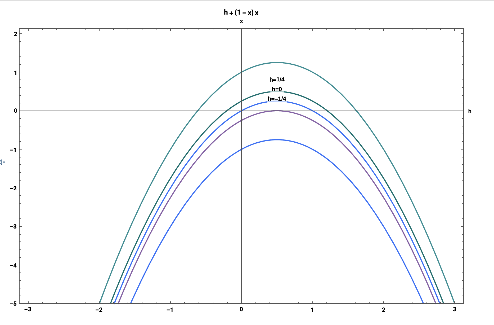

\definecolor{OliveGreen}{rgb}{0, 0.4, 0.4}
\definecolor{OliveGreen2}{RGB}{125, 207, 203}

\definecolor{PrettyPink}{rgb}{1, 0, 0.3}
\definecolor{MorePink}{RGB}{254, 221, 247}
\definecolor{pinkyswear}{RGB}{254, 221, 247}
\definecolor{pinkyswear2}{RGB}{255, 225, 224}


\definecolor{Green}{RGB}{221, 254, 227}

\definecolor{PurpleBlue}{rgb}{0.4,0.1,1}
\definecolor{PurpleBlue2}{RGB}{186, 216, 253}

```{r, setup, include=FALSE}
require(mosaic)   # Load additional packages here 
knitr::opts_chunk$set(
  tidy=FALSE,     # display code as typed
  size="small")   # slightly smaller font for code
```

\maketitle

\ 

\begin{abstract}
The qualitative structure of the flow can change as parameters are varied. Mainly, fixed points can be created or destroyed, or their stability can vary. These qualitative changes in the dynamics are bifurcations and the parameter values at which they occur are bifurcation points. The \colorbox{OliveGreen2}{\scshape saddle-node bifurcation} occurs such that as a parameter is varied, two fixed points move toward each other, unite, and respectively exterminate. The \colorbox{pinkyswear}{\scshape transcritical bifurcation} happens such that as a parameter is varied, a change in stability takes place for some fixed point that exists for all values of a parameter (never disappear). Lastly, the \colorbox{PurpleBlue2}{\scshape pitchfork bifurcation} corresponds to two fixed points that tend to appear and disappear in symmetrical pairs. There are two pitchfork bifurcations: Supercritical and Subcritical Pitchfork Bifurcation.
\end{abstract}

\newpage


## Dimensionless variables

Consider the first order system 

\begin{center}
\colorbox{PurpleBlue2}{\large $\dot u = au + bu^3 - cu^5$}
\end{center}

Show that this equation can be rewritten as

$$\bf \frac{dx}{d\tau}= rx + x^3 - x^5$$ 
for appropriate dimensionless variables $x, \tau$. Here r is a dimensionless parameter determined in terms of a, b, and c.


\textcolor{PrettyPink}{\Large 1.} Write the first order system explicitly as 

$$\frac{du}{dt}=au+bu^3-cu^5$$

\textcolor{PrettyPink}{\large \quad a.} Make the substitution as

\begin{align*}
\tau = (\alpha)(t) \\
x = (\beta)(u) \\
& \Longrightarrow \alpha, \beta \small \text{ need to be determined}
\end{align*}

\textcolor{PrettyPink}{\large \quad b.} The derivative of u with respect to t is written as


$$\frac{du}{dt}=\frac{d\tau}{dt}\frac{du}{d\tau}$$


\textcolor{PrettyPink}{\Large 2.} Calculate the right term derivative as


$$\bigstar \; \bf \frac{d\tau}{dt}= \frac{d(\alpha t)}{dt} = \alpha$$
$$\bigstar \; \bf \frac{du}{d\tau}= \frac{d(\frac{x}{\beta})}{dt} = \frac{1}{\beta}\frac{dx}{d\tau}$$


\textcolor{PrettyPink}{\Large 3.} Substitute the expression of derivative terms to solve $\frac{du}{dt}$.

$$\frac{du}{dt}=\frac{d\tau}{dt}\frac{du}{d\tau}= \alpha(\frac{1}{\beta})(\frac{dx}{d\tau})$$


\textcolor{PrettyPink}{\Large 4.} Rewrite the first-order system in terms of above substitutions as,

$$\frac{du}{dt} = \frac{\alpha}{\beta}(\frac{dx}{d\tau}) \qquad \Rightarrow u=\frac{x}{\beta}$$


\begin{align*}
\frac{\alpha}{\beta}(\frac{dx}{d\tau}) &= \frac{ax}{\beta} + \frac{bx^3}{\beta^3} - \frac{cx^5}{\beta^5} \\
\alpha(\frac{dx}{d\tau}) &= {ax} + \frac{bx^3}{\beta^2} - \frac{cx^5}{\beta^4} \\
\frac{dx}{d\tau} &= \frac{ax}{\alpha} + \frac{bx^3}{\alpha \beta^2} - \frac{cx^5}{\alpha \beta^4}
\end{align*}


\textcolor{PrettyPink}{\Large 5.} Derive the requisite dimensionless form as


\begin{align*}
\frac{b}{\alpha \beta^2}&=1 & \frac{c}{\alpha\beta^4}&=1
\end{align*}


\textcolor{PrettyPink}{\Large 6.} Equate the above equations and solve for $\beta$ as


\begin{align*}
\frac{b}{\alpha \beta^2} &= \frac{c}{\alpha\beta^4} \\
\beta^2 &= \frac{c}{b} \\
\bigstar \quad \bf \beta &= \sqrt\frac{c}{b}
\end{align*}


\textcolor{PrettyPink}{\Large 7.} Similarly, $\alpha$ is computed as,

\begin{align*}
\frac{b}{\alpha \beta^2} &= \frac{c}{\alpha\beta^4} \\
\alpha &= \frac{c}{\beta^4} = \frac{c}{\sqrt\frac{c}{b}^4} \\
\bigstar \quad \bf \alpha &= \frac{b^2}{c}
\end{align*}


\textcolor{PrettyPink}{\Large 8.} Substitute the values of $\beta$ and $\alpha$ into the modified expression of first order system


\begin{align*}
\frac{dx}{d\tau} &= \frac{ax}{\alpha} + \frac{bx^3}{\alpha \beta^2} - \frac{cx^5}{\alpha \beta^4} \\
&= \frac{ax}{\frac{b^2}{c}} + \frac{bx^3}{\frac{b^2}{c} \sqrt\frac{c}{b}^2} - \frac{cx^5}{\frac{b^2}{c} \sqrt\frac{c}{b}^4} \\
&= \frac{ac}{b^2}x + (1)x^3 - (1)x^5
\end{align*}


\textcolor{PrettyPink}{\large $$\bigstar\bigstar\bigstar$$ }


\begin{center}
\colorbox{MorePink}{\Large $\frac{dx}{d\tau} = rx + x^3 - x^5$} \\
\colorbox{pinkyswear2}{\Large $\bf r=(\frac{ac}{b^2})$}
\end{center}


---------------------------------------

\newpage


## 3.7.5. Zebra stripes and butterfly wing patterns 

\begin{center}
\colorbox{Green}{\large $\dot g = k_1 s_0 - k_2g + \frac{k_3 g^2}{k_4^2 + g^2}$}
\end{center}

a. Show that the system can be put in the dimensionless form $$\frac{dx}{d\tau}=s-rx+ \frac{x^2}{1+x^2}$$ where $r > 0$ and $s > 0$ are dimensionless groups.

\colorbox{MorePink}{\Large 1.}


b. Show that if $s = 0$, there are two positive fixed points if $r < rc$, where $rc$ is to be determined.

c. Assume that initially there is no gene product, i.e., $g(0) = 0$, and suppose $s$ is slowly increased from 0 (the activating signal is turned on); what happens to $g(t)$? What happens if s then goes back to zero? Does the gene turn off again?

\newpage


## Simple Model of Fishery

Let N(t) be the population of fish at time t. The model is given by 

\begin{center}
\colorbox{Green}{\large $\dot N = rN(1-\frac{N}{k}) - HN$}
\end{center}


a. Give a biological interpretation of each term in this model. What is the meaning of the constants $r, k, H$?


Here \colorbox{MorePink}{\large $N$} is the population, \colorbox{MorePink}{\large $\dot N$} is the rate of change in population with time, \colorbox{MorePink}{\large $r$} is the rate at which population grows when it is small (intrinsic rate of population increase),\colorbox{MorePink}{\large $k$} is the carrying capacity of the population and \colorbox{MorePink}{\large $H$} is the number of individuals being removed from the population, that is, the harvesting rate.

b. Show that this system can be rewritten as
$$\frac{dx}{d\tau}=x (1-x) - hx$$
for appropriate dimensionless variables x and $\tau$. Here h is a dimensionless parameter determined in terms of $r, k, H$.

\textcolor{OliveGreen}{\Large 1.} Divide the above equation by $rk$,

$$\frac{\dot N}{rk}=\frac{N}{k}(1-\frac{N}{k})-\frac{H}{rk}$$

\textcolor{OliveGreen}{\Large 2.} Make substitution as,


\begin{align*}
x&=\frac{N}{k} & \tau &= rt & h&=\frac{H}{rk}
\end{align*}


\textcolor{OliveGreen}{\Large 3.} Derivative of $x$ with respect to $r$ is written as,


\begin{align*}
\frac{dx}{d\tau} &= \frac{d \frac{N}{K}}{d(rt)} \\
&= (\frac{1}{rK})\frac{dN}{dt} \\
&= \frac{\dot N}{rK}
\end{align*}


\textcolor{OliveGreen}{\Large 4.} Rewrite the harvesting model in terms of substitutions as,


\begin{align*}
\dot N &= rN(1-\frac{N}{K})-H \\
\frac{\dot N}{rk} &= \frac{N}{k}(1-\frac{N}{k})-\frac{H}{rk} \\
&= x(1-x)-h
\end{align*}


Hence the harvesting model is written in dimensionless form as \colorbox{pinkyswear}{\Large $\frac{dx}{d\tau} = x(1-x)-h$}.


c. Sketch the bifurcation diagram of fixed points $x^*$ versus $h$.

For h = $\frac{1}{4}$, there is a partially stable fixed point, which vanishes as the value of $h$ increases. Therefore, at $h=h_c=\frac{1}{4}$ and $x=\frac{1}{2}$. The derivative term of the dimensional form of harvesting model calculated above equals zero and a \colorbox{pinkyswear}{\Large saddle node bifurcation} occurs a $h_c$.


From the vector field plots it can inferred that, for $h<h_c$, the population never decreases or increases $\Rightarrow$ hence, the fish are sustainable harvested. For $h>h_c$, it might be that the fish population can never become negative. Therefore, it can be said that the fish are hunted till they become extinct.
 

```{r echo=FALSE, fig.align='center', out.width=320, message=FALSE}

```


\newpage


# Interpretation and analysis of a mathematical model

\ 


\textcolor{OliveGreen}{\Large\scshape SIS and Population Growth}


a. The simplest model of malaria assumes that the mosquito population is at equilibrium and models the proportion of humans that are infected I(t) and is given by the following equation

\begin{center}
\colorbox{OliveGreen2}{\Large $\bf \dot I = \frac{\alpha \beta I}{\alpha I + r} (1-I) - \mu I - T(I)$}
\end{center}

where $r$ is the natural death rate of the mosquitoes, $\mu$ is the natural death rate of humans, $\beta$ is the transmission rate from infected mosquitoes to susceptible humans,$\alpha$ is the transmission rate from humans to mosquitoes and $T(I)$ is a treatment procedure.

a. If T = 0, find the fixed points of the model and determine their stability. Interpret your results in practical terms.

b. Explain what this treatment procedure models in practical terms. Find the fixed points for this model, the conditions for their existence, and their stability. Interpret your results in practical terms.


\newpage


## Consider the following modified version of the SIS model where $\alpha,\beta,\sigma$ are constants:


$$\dot S = - \frac{\beta S}{1 + \sigma S} + \alpha I$$

$$\dot I = \frac{\beta S}{1+\sigma S} I - \alpha I$$

a. Explain this model in practical terms.

b. Reduce model to a single equation.

c. Determine the threshold criteria for the existence of an endemic equilibrium. Explain your results in practical terms.


\newpage
