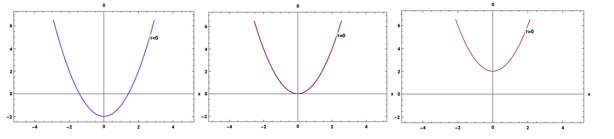
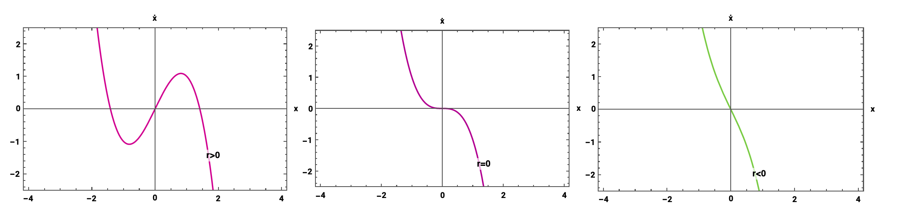
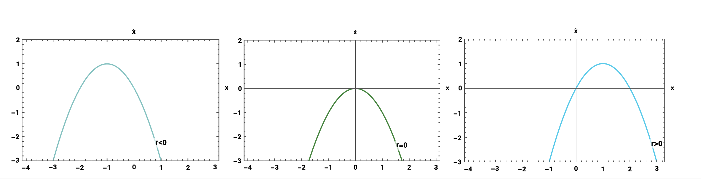
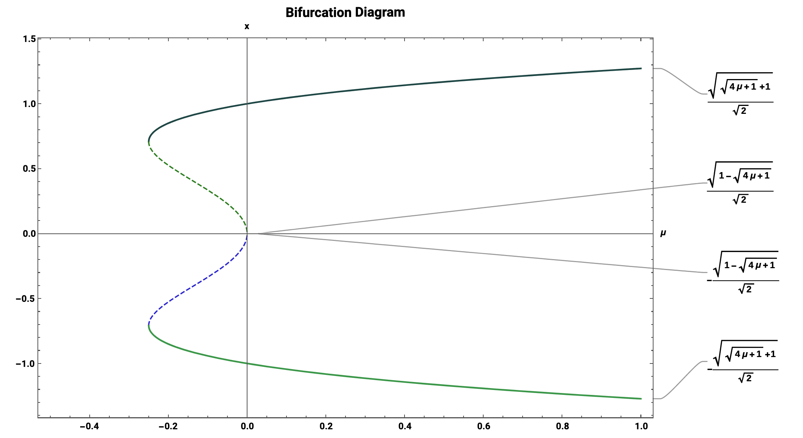
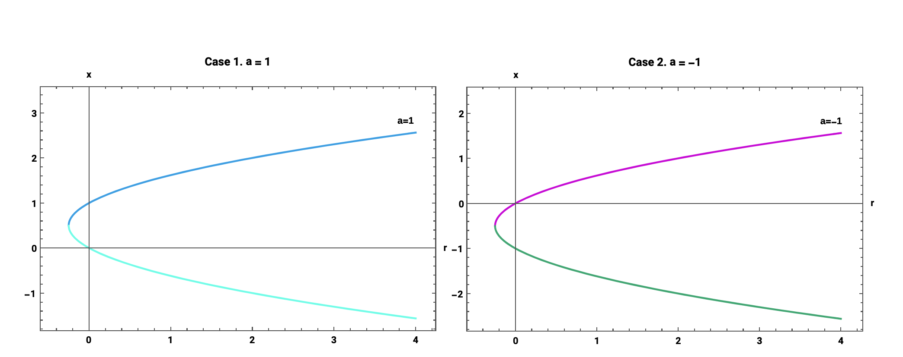

\definecolor{OliveGreen}{rgb}{0, 0.4, 0.4}
\definecolor{OliveGreen2}{RGB}{125, 207, 203}

\definecolor{PrettyPink}{rgb}{1, 0, 0.3}
\definecolor{MorePink}{RGB}{254, 221, 247}

\definecolor{pinkyswear}{RGB}{254, 221, 247}

\definecolor{Green}{RGB}{221, 254, 227}

\definecolor{PurpleBlue}{rgb}{0.4,0.1,1}
\definecolor{PurpleBlue2}{RGB}{186, 216, 253}


```{r, setup, include=FALSE}
require(mosaic)   # Load additional packages here 
knitr::opts_chunk$set(
  tidy=FALSE,     # display code as typed
  size="small")   # slightly smaller font for code
```


\maketitle

\ 

\begin{abstract}
The qualitative structure of the flow can change as parameters are varied. Mainly, fixed points can be created or destroyed, or their stability can vary. These qualitative changes in the dynamics are bifurcations and the parameter values at which they occur are bifurcation points. The \colorbox{OliveGreen2}{\scshape saddle-node bifurcation} occurs such that as a parameter is varied, two fixed points move toward each other, unite, and respectively exterminate. The \colorbox{pinkyswear}{\scshape transcritical bifurcation} happens such that as a parameter is varied, a change in stability takes place for some fixed point that exists for all values of a parameter (never disappear). Lastly, the \colorbox{PurpleBlue2}{\scshape pitchfork bifurcation} corresponds to two fixed points that tend to appear and disappear in symmetrical pairs. There are two pitchfork bifurcations: Supercritical and Subcritical Pitchfork Bifurcation.
\end{abstract}

\newpage

\textcolor{OliveGreen}{\Large\scshape Saddle Node Bifurcations:}

# Saddle Node Bifurcations: 

\begin{center}
\colorbox{OliveGreen2}{\large $\dot x=r+x^2$}
\end{center}

```{r echo=FALSE, fig.align='center', out.width=520, message=FALSE}

```


\newpage


## Consider the dynamical system where $r \in \mathit{R}$ is a parameter. Sketch the phase portraits as r is varied.

\begin{center}
\colorbox{Green}{\large $\dot x = r - x^2 = f(x;r)$}
\end{center}

\ 


```{r echo=FALSE, message=FALSE, fig.dim=c(3.3,3.5)}
graph_empty <- curve(0*x, ylab = "", xlab = "", xlim=c(-2,2), ylim=c(-2,2))
grid()
graph_empty <- curve(0*x, ylab = "", xlab = "", xlim=c(-2,2), ylim=c(-2,2))
grid()
graph_empty <- curve(0*x, ylab = "", xlab = "", xlim=c(-2,2), ylim=c(-2,2))
grid()
graph_empty <- curve(0*x, ylab = "", xlab = "", xlim=c(-2,2), ylim=c(-2,2))
grid()
```


\newpage


## Consider the dynamical system where $r \in \mathit{R}$ is a parameter. Sketch the phase portraits as r is varied.

\begin{center}
\colorbox{Green}{\large $\dot x = 1+rx+x^2$}
\end{center}

\ 

```{r echo=FALSE, message=FALSE, fig.dim=c(3.3,3.5)}
graph_empty <- curve(0*x, ylab = "", xlab = "", xlim=c(-2,2), ylim=c(-2,2))
grid()
graph_empty <- curve(0*x, ylab = "", xlab = "", xlim=c(-2,2), ylim=c(-2,2))
grid()
graph_empty <- curve(0*x, ylab = "", xlab = "", xlim=c(-2,2), ylim=c(-2,2))
grid()
graph_empty <- curve(0*x, ylab = "", xlab = "", xlim=c(-2,2), ylim=c(-2,2))
grid()
```


\newpage

\textcolor{PrettyPink}{\Large\scshape Pitchfork Bifurcation:}


# Pitchfork Bifurcation

\ 

\begin{center}
\colorbox{pinkyswear}{\large $\dot x=rx-x^3$}
\end{center}

```{r echo=FALSE, fig.align='center', out.width=520, message=FALSE}

```


\newpage


## Consider the dynamical system where $r \in \mathit{R}$ is a parameter. Sketch the phase portraits as r is varied. 

\begin{center}
\colorbox{Green}{\large $\dot x = rx+x^2$}
\end{center}


\ 

```{r echo=FALSE, message=FALSE, fig.dim=c(3.3,3.5)}
graph_empty <- curve(0*x, ylab = "", xlab = "", xlim=c(-2,2), ylim=c(-2,2))
grid()
graph_empty <- curve(0*x, ylab = "", xlab = "", xlim=c(-2,2), ylim=c(-2,2))
grid()
graph_empty <- curve(0*x, ylab = "", xlab = "", xlim=c(-2,2), ylim=c(-2,2))
grid()
graph_empty <- curve(0*x, ylab = "", xlab = "", xlim=c(-2,2), ylim=c(-2,2))
grid()
```


\newpage


## Consider the dynamical system where $r \in \mathit{R}$ is a parameter. Sketch the phase portraits as r is varied.

\begin{center}
\colorbox{Green}{\large $\dot x = x+ \frac{rx}{1+x^2}$}
\end{center}


\ 


```{r echo=FALSE, message=FALSE, fig.dim=c(3.3,3.5)}
graph_empty <- curve(0*x, ylab = "", xlab = "", xlim=c(-2,2), ylim=c(-2,2))
grid()
graph_empty <- curve(0*x, ylab = "", xlab = "", xlim=c(-2,2), ylim=c(-2,2))
grid()
graph_empty <- curve(0*x, ylab = "", xlab = "", xlim=c(-2,2), ylim=c(-2,2))
grid()
graph_empty <- curve(0*x, ylab = "", xlab = "", xlim=c(-2,2), ylim=c(-2,2))
grid()
```


\newpage


## Consider the dynamical system where $r \in \mathit{R}$ is a parameter. Sketch the phase portraits as r is varied.

\begin{center}
\colorbox{Green}{\large $\dot x = rx+ \frac{rx}{1+x^3}$}
\end{center}

\ 


```{r echo=FALSE, message=FALSE, fig.dim=c(3.3,3.5)}
graph_empty <- curve(0*x, ylab = "", xlab = "", xlim=c(-2,2), ylim=c(-2,2))
grid()
graph_empty <- curve(0*x, ylab = "", xlab = "", xlim=c(-2,2), ylim=c(-2,2))
grid()
graph_empty <- curve(0*x, ylab = "", xlab = "", xlim=c(-2,2), ylim=c(-2,2))
grid()
graph_empty <- curve(0*x, ylab = "", xlab = "", xlim=c(-2,2), ylim=c(-2,2))
grid()
```


\newpage

\textcolor{PurpleBlue}{\Large\scshape Transcritical Bifurcation:}


# Transcritical Bifurcation


\begin{center}
\colorbox{PurpleBlue2}{\large $\dot x=rx-x^2$}
\end{center}


```{r echo=FALSE, fig.align='center', out.width=520, message=FALSE}

```


\newpage


## Consider the dynamical system where $r \in \mathit{R}$ is a parameter. Sketch the phase portraits as r is varied.

\begin{center}
\colorbox{Green}{\large $\dot x = x- \frac{rx}{1+x}$}
\end{center}

\ 


```{r echo=FALSE, message=FALSE, fig.dim=c(3.3,3.5)}
graph_empty <- curve(0*x, ylab = "", xlab = "", xlim=c(-2,2), ylim=c(-2,2))
grid()
graph_empty <- curve(0*x, ylab = "", xlab = "", xlim=c(-2,2), ylim=c(-2,2))
grid()
graph_empty <- curve(0*x, ylab = "", xlab = "", xlim=c(-2,2), ylim=c(-2,2))
grid()
graph_empty <- curve(0*x, ylab = "", xlab = "", xlim=c(-2,2), ylim=c(-2,2))
grid()
```

\newpage


## Sketch the phase portraits as r is varied.

\begin{center}
\colorbox{Green}{\large $\dot x = x- \frac{rx}{1+x^2}$}
\end{center}


\ 

```{r echo=FALSE, message=FALSE, fig.dim=c(3.3,3.5)}
graph_empty <- curve(0*x, ylab = "", xlab = "", xlim=c(-2,2), ylim=c(-2,2))
grid()
graph_empty <- curve(0*x, ylab = "", xlab = "", xlim=c(-2,2), ylim=c(-2,2))
grid()
graph_empty <- curve(0*x, ylab = "", xlab = "", xlim=c(-2,2), ylim=c(-2,2))
grid()
graph_empty <- curve(0*x, ylab = "", xlab = "", xlim=c(-2,2), ylim=c(-2,2))
grid()
```


\newpage

# Mixed Examples:


## Sketch the bifurcation diagram for the system

\begin{center}
\colorbox{Green}{\large $\bf \dot x = \mu x+x^3-x^5$}
\end{center}


The equilibria satisfy $\bf \dot x = 0$

\begin{align*}
\mu x+x^3-x^5 &= 0 \\
x(\mu+x^2-x^4) &= 0 \\
x^* &= 0 \; \small \text{ or } \\
x^2 &= \frac{1 \pm \sqrt{1+4 \mu}}{2} \\
x^* &= \pm \sqrt{\frac{1 \pm \sqrt{1+4 \mu}}{2}}
\end{align*}

\ 

\textcolor{OliveGreen}{\large Analyzing various $\mu$ values:}


The fixed points are \textcolor{PrettyPink}{$x^*=0$} and \textcolor{PrettyPink}{$x^*=\pm \sqrt{\frac{1\pm \sqrt{1+4 \mu}}{2}}$}


It follows that $\frac{1 \pm \sqrt{1+4 \mu}}{2} > 0$: 


\begin{align}
1\pm\sqrt{1+4\mu} & > 0 \\ 
\pm \sqrt{1+4 \mu} & > - 1 \\
\sqrt{1+4 \mu} & > -1 & \sqrt{1+4\mu} & < 1 & 1+4 \mu & > 0\\
1+4\mu & > 1 & 1+4\mu & < \pm 1 & 4 \mu & > -1 \\
\mu & > 0 & \mu & < {0} & \mu & > \frac{-1}{4} 
\end{align}


\ 

So for the 4 values of $x^*=\pm\sqrt{\frac{1 \pm \sqrt{1+4 \mu}}{2}}$,

a. if $\mu < \frac{-1}{4}$, both roots are **complex**

$\qquad \Longrightarrow$ no equilibra in addition to $x=0$

b. if $\frac{-1}{4} < \mu < 0$, both roots are **real and positive**

$\qquad \Longrightarrow$ 4 additional equilibra in addition to $x=0$

c. if $\mu >0$, one root is a **real and positive** and one root is **real and negative**

$\qquad \Longrightarrow$ 2 additional equilibra in addition to $x=0$

\ 

A sub-critical pitchfork bifurcation occurs at $(x,\mu)=(0,0)$, and a saddle-node bifurcation occurs at  $(x,\mu)= \pm (\frac{1}{2},- \frac{1}{4})$. We have $f_x(0,\mu) = \frac{d}{d \dot x}{(\mu x+x^3-x^5)}|_{x=0} = \mu$. 

* So the equilibrium **x=0** is **stable** for $\mu < 0$ and **unstable** for $\mu > 0$. Similarly, the branches 

$$x=\pm\sqrt{\frac{1+\sqrt{1+4 \mu}}{2}}$$
are **stable** if $\mu > -1/4$, and the branches

$$x=\pm\sqrt{\frac{1-\sqrt{1+4 \mu}}{2}}$$
are **unstable** if $-1/4 < \mu < 0$.

\ 

```{r echo=FALSE, fig.align="left", out.width=500, message=FALSE}



```


\newpage

## Consider the following system with parameters $r,a \in R$

\begin{center}
\colorbox{Green}{\large $\dot x = rx+ax^2-x^3$}
\end{center}


a. For each a, there is a bifurcation diagram in the parameter **r**. As a varies, these bifurcations can undergo qualitative changes. Sketch all of the qualitatively different bifurcation diagrams that can be obtained by **varying a**.

* **Note.** If a = 0, it follows that $\dot x = rx-x^3$, which gives normal super-critical pitchfork bifurcation. 

\colorbox{MorePink}{Find the fixed points $\dot x =0$:}

Fixed points are obtained by setting $f(x,r)=0$. 


\begin{align*}
0=& -x^2+ax+r \\
=& x(r+ax-x^2) \\
&\Longrightarrow \bf x^* =0 \quad & \text{or} \\
&&0 &= -x^2+ax+r \\
&&&= \frac{-a \pm \sqrt{a^2 - 4(-1*r)}}{2(-1)} \\
&&&\Longrightarrow \bf x^*= \frac{1}{2}(a \pm \sqrt{a^2 + 4r})
\end{align*}


So we obtain fixed points $\bf \dot x = \bf 0$ and $\bf \dot x = \bf \frac{1}{2}(a \pm \sqrt{a^2 + 4r})$. For the fixed points $x^*$, $a^2+4r > 0$:

\begin{align*}
a^2+4r &> 0 \\
4r &> -a^2 \\
r &> -\frac{a^2}{4}
\end{align*}

Therefore, the first fixed point occurs at $x^*=0$, and the second fixed point occurs **only when** $\bf r > -\frac{a^2}{4}$.  The second fixed point can be taken as $-x^2+ax+r=0$. Hence, $r=x^2-ax$.


\colorbox{MorePink}{Varying a values to find fixed points:}

\textcolor{OliveGreen}{$$x^*=0, \qquad x_{\small +-}^*=\frac{1}{2}(a \pm \sqrt{a^2 + 4r})$$}


a. **Case 1.** $a=-1$


\begin{align*}
\bf a &= -1 & \bf r &= -\frac{a^2}{4} & \bf x^* &= \frac{1}{2}(a \pm \sqrt{a^2 + 4r})\\
&&&= \frac{-(-1)^2}{4} = \bf -\frac{1}{4} && = \frac{1}{2}(-1 \pm \sqrt{1 + 4(\frac{-1}{4})}) = \bf -\frac{1}{2} 
\end{align*}


$\bigstar \;$ Therefore, for parameter $a=-1$, we obtain $\bf r= -\frac{1}{4}$ and the fixed point $\bf x^* = -\frac{1}{2}$.

\ 

b. **Case 2.** $a=0$


\begin{align*}
\bf a &= 0 & \bf r &= -\frac{a^2}{4} & \bf x^* &= \frac{1}{2}(a \pm \sqrt{a^2 + 4r})\\
&&&= 0 && = \frac{1}{2}(0 \pm \sqrt{0^2 + 4(0)}) = 0
\end{align*}


$\bigstar\;$ Therefore, for parameter $a=0$, we obtain $\bf r= 0$ and the fixed point $\bf x^* = 0$.

\ 

c. **Case 3.** $a=1$


\begin{align*}
\bf a &= 1 & \bf r &= -\frac{a^2}{4} & \bf x^* &= \frac{1}{2}(a \pm \sqrt{a^2 + 4r}) \\
&&&= -\frac{(1)^2}{4} = \bf -\frac{1}{4} && = \frac{1}{2}(1 \pm \sqrt{1^2 + 4(\frac{-1}{4})}) = \bf \frac{1}{2} 
\end{align*}


$\bigstar\;$ Therefore, for parameter $a=1$, we obtain $\bf r= \frac{1}{4}$ and the fixed point $\bf x^* = \frac{1}{2}$.

\ 


b. Summarize your results by plotting a “phase diagram” in the parameters **r and a**. That is, plot the regions in the (r,a) plane that correspond to qualitatively different class of vector fields. Bifurcations occur on the boundaries of these regions; identify the types of bifurcations that occur.


$$x^*=0, \quad x_{\small +-}^*=\frac{1}{2}(a \pm \sqrt{a^2 + 4r})$$

For **a = 1**, $x^*=\frac{1}{2}(1 \pm \sqrt{1 + 4r})$, and for **a = -1**, $x^*=\frac{1}{2}(-1 \pm \sqrt{1 + 4r})$.


```{r echo=FALSE, fig.align='left',out.width=500, message=FALSE}

```


\newpage

## Sketch the bifurcation diagram for the system 

\begin{center}
\colorbox{Green}{\large $\dot x = rx- \sin{x}$}
\end{center}


\ 

```{r echo=FALSE, message=FALSE, fig.dim=c(3.3,3.5)}
graph_empty <- curve(0*x, ylab = "", xlab = "", xlim=c(-2,2), ylim=c(-2,2))
grid()
graph_empty <- curve(0*x, ylab = "", xlab = "", xlim=c(-2,2), ylim=c(-2,2))
grid()
graph_empty <- curve(0*x, ylab = "", xlab = "", xlim=c(-2,2), ylim=c(-2,2))
grid()
graph_empty <- curve(0*x, ylab = "", xlab = "", xlim=c(-2,2), ylim=c(-2,2))
grid()
```


\ 


\newpage


## Maxwell-Bloch equations:


$$\dot E = K(P-E)\\$$
$$\dot P = \gamma_1(ED-P)$$
$$\dot D =\gamma_2(\lambda+(-D-\lambda EP))$$


a. Assume $\dot P =\dot E=0$ and derive a differntial equation for E

b. Find all fixed points for this equation

c. Draw the bifurcation diagram of $E \; vs \; \lambda$


\newpage


## Sketch a bifurcation diagram for the following system:

\begin{center}
\colorbox{Green}{\large $\dot x = -x(x-1)(x+1)+\mu$}
\end{center}

\ 

```{r echo=FALSE, fig.align='center', fig.dim=c(5,4),fig.height=550, fig.width=750, message=FALSE}
knitr::include_graphics('images/saddlecurves.pdf')
```


```{r echo=FALSE, message=FALSE, fig.dim=c(4,3.5), fig.align='center'}
graph_empty <- curve(0*x, ylab = "", xlab = "", xlim=c(-20,20), ylim=c(-20,20))
grid()


library(phaseR)
exampleb <- function (t, y, parameters) {list(y -y^3)}
exampleb_phasePortrait <- phasePortrait(
  exampleb,ylim = c(-1.5, 1.5),points = 10,frac = 0.5, col = c("blue", "navy"))
grid()
```


\ 


\newpage


